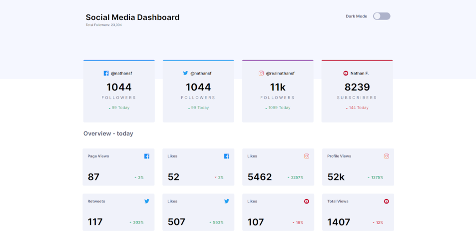
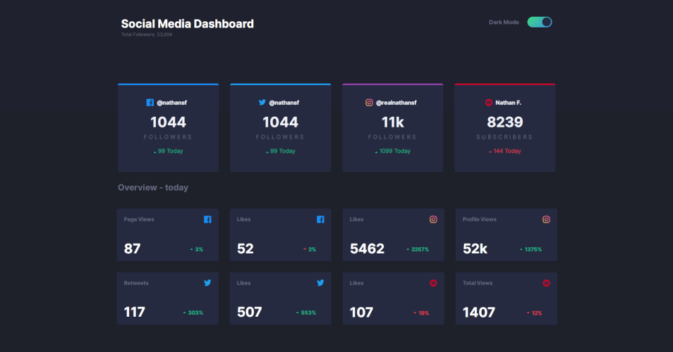

  <a href="#-tecnologias">Tecnologias</a>&nbsp;&nbsp;
  <a href="#-projeto">Projeto</a>&nbsp;&nbsp;

<h2>LIGHT THEME</h2>

<h2>DARK THEME</h2>

 

## 🚀 Tecnologias

Esse projeto foi desenvolvido com as seguintes tecnologias:

- HTML
- SCSS
- JavaScript

## 💻 Projeto

UI responsivo de um dashboard para controle de redes sociais, é possível alternar entre o tema light e dark.
